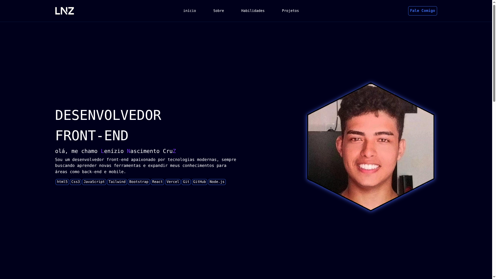

# Portfolio
Olá! 👋 Seja bem-vindo ao meu portfólio profissional.
Este projeto foi desenvolvido com criatividade, dedicação e atenção aos detalhes, com o objetivo de proporcionar uma ótima experiência de navegação e demonstrar, na prática, minhas habilidades técnicas e minha organização.

Espero que este espaço possa servir de inspiração e, caso tenha interesse, será um prazer conversarmos sobre possíveis colaborações ou trabalharmos juntos em novos desafios.

Portfólio pessoal de Lenizio Nascimento

## 🚀 Funcionalidades
- **Dinâmica:** Designer responsivo e amigavel.
- **Design Responsivo:** Interface adaptável para dispositivos móveis e desktop.
- **UX Otimizada:** transição e gerenciamento de estado eficiente com React Hooks.

## 🛠️ Tecnologias Utilizadas
- **React.js**: Biblioteca principal para construção da interface.
- **Tailwind CSS**: Framework utilitário para estilização rápida e moderna.
- **Lucide React / PrimeIcons**: Conjunto de ícones para melhor auxílio visual.
- **Vite**: Ferramenta de build para um desenvolvimento ágil.
- **JavaScript**: Linguagem de programação utilizada no projeto

## Autor

**Lenízio Nascimento**
## 📦 Veja o Projeto
👉Acesse **[aqui](https://portfolio-lenizionascimento.vercel.app/)**